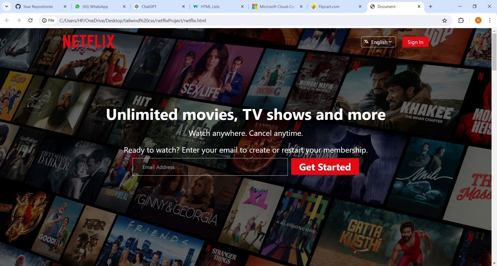

<h1>Netflix Landing Page UI</h1>

This project is a responsive Netflix landing page UI created using HTML5, CSS, jQuery, and Tailwind CSS. The goal is to replicate the look and feel of Netflix's landing page while ensuring responsiveness across different devices.

<h2 id="screenshots">Screenshots</h2>

 

 <h2 id="features">Features</h2>
 <ul>
        <li>Responsive design that works on desktop, tablet, and mobile devices</li>
        <li>Smooth animations and transitions using jQuery</li>
        <li>Modern UI elements with Tailwind CSS</li>
        <li>HTML5 semantic elements for better accessibility and SEO</li>
 </ul>
 <h2 id="technologies-used">Technologies Used</h2>
<ul>
        <li>HTML5</li>
        <li>CSS</li>
        <li>jQuery</li>
        <li>Tailwind CSS</li>
</ul>
 <h2 id="installation">Installation</h2>
   
To run this project locally, follow these steps:

 <ol>
        <li>Clone the repository: <code>git clone https://github.com/yourusername/netflix-landing-page.git</code></li>
        <li>Navigate to the project directory: <code>cd netflix-landing-page</code></li>
        <li>Open <code>index.html</code> in your preferred web browser</li>
 </ol>

 <h2 id="usage">Usage</h2>
 
This project can be used as a starting point for building similar landing pages or as a learning resource for HTML5, CSS, jQuery, and Tailwind CSS. Feel free to modify and adapt it to your needs.

<h2>Keywords</h2>

Responsive Design, Netflix UI, Landing Page, HTML5, CSS, jQuery, Tailwind CSS, Web Development, Frontend Development

